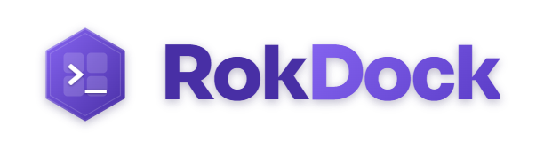
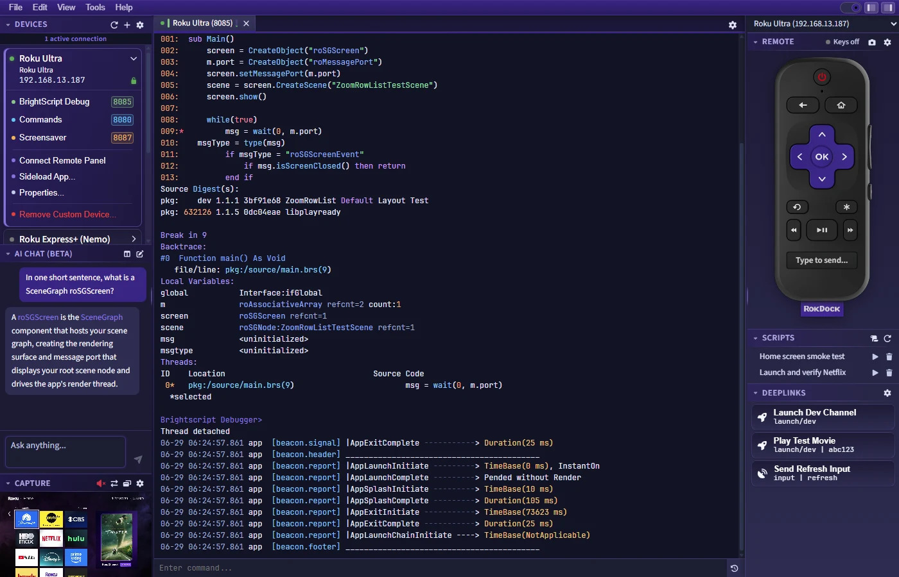
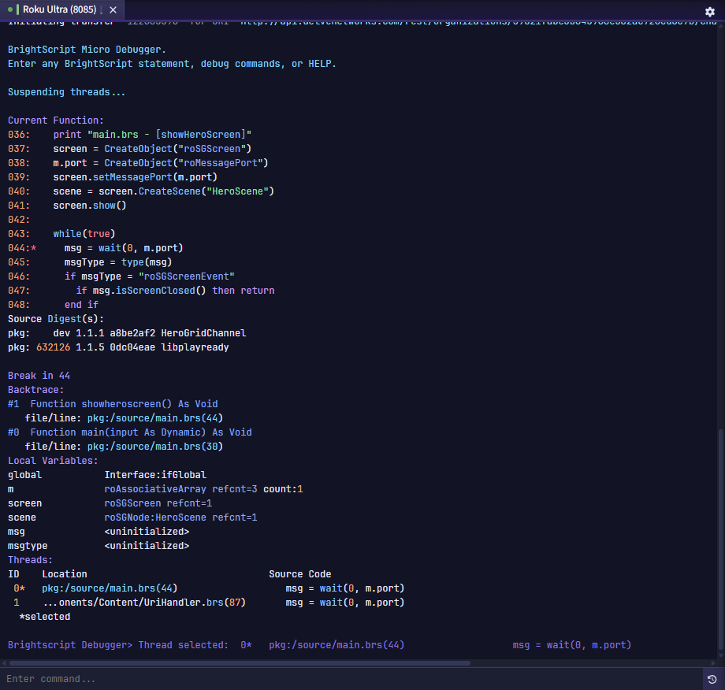
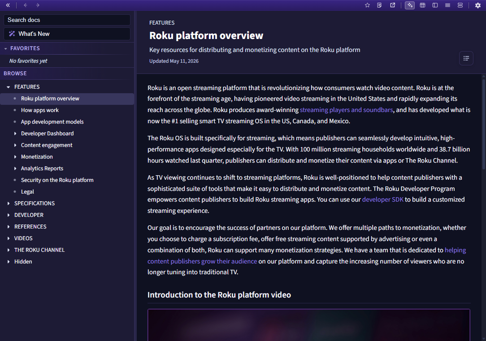
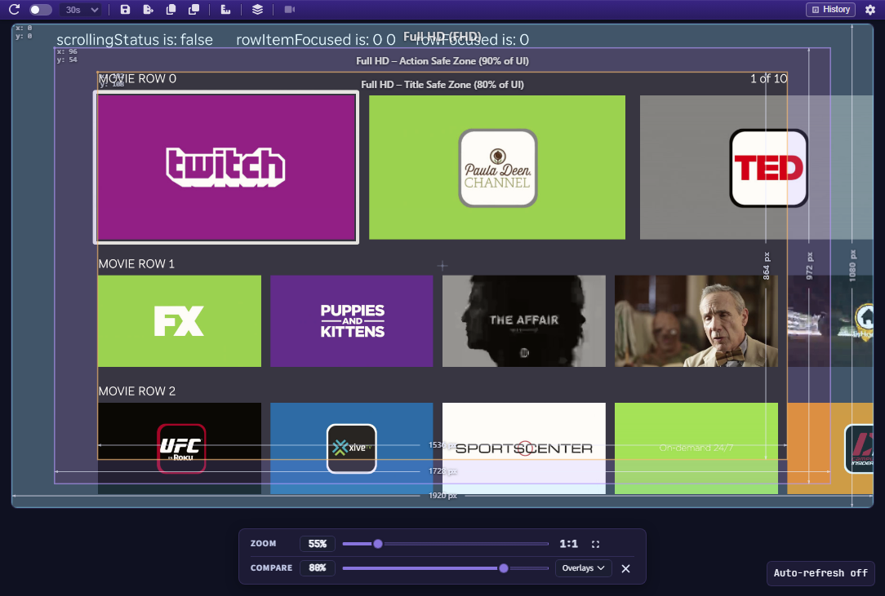
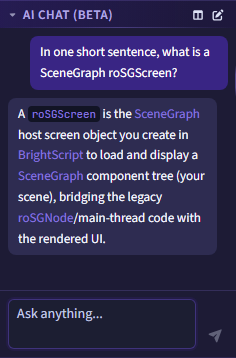

<p align="center">
  <picture>
    <source media="(prefers-color-scheme: dark)" srcset="docs/banner-dark.png" />
    
  </picture>
</p>

<p align="center">
  
  
  
  
  
</p>
<p align="center">
  
  
  
  
</p>
<p align="center">
  
  
  
</p>
<p align="center">
  
  
  
  
</p>

RokDock is a cross-platform desktop control center for Roku development. It brings
the whole Roku workflow into one window: discover devices on your network, open
BrightScript debug terminals, drive an on-screen remote, sideload channels, capture
and compare device screenshots, automate device tests, fire deeplinks, build
SceneGraph image assets, and read the official Roku developer docs in-app. An opt-in
AI assistant is built in.

It is for Roku channel developers who are tired of juggling a telnet client, the ECP
`curl` commands, the deeplink tester, an image editor, and a browser tab of docs.
RokDock is one tool for all of it.

<p align="center">
  
</p>

## Features

**Connect and debug**

- **Device discovery** - automatic SSDP discovery plus manual device entries by IP.
- **Debug terminal** - a multi-tab telnet terminal with BrightScript syntax
  highlighting, search, command history, output streaming to a file, and
  click-to-open detection of JSON payloads and URLs in the log.

**Control and test**

- **Virtual remote** - an on-screen ECP remote with configurable keyboard bindings
  and a text-entry field.
- **Sideloading** - upload a `.zip` (or signed `.pkg`) channel package straight to a
  developer-mode device.
- **Screenshot capture** - pull device screenshots, then zoom, pan, measure, compare
  against reference overlays (onion-skin), and auto-refresh, with a saved history.
- **Deeplinks** - reusable launch and input deeplink presets, fired at the selected
  device and shareable via the RokuDeepLinking JSON format.
- **Automation scripts** - sequence device actions as typed steps, record from the
  remote, and import/export RASP (Roku Automation Script Protocol) YAML.

**Build assets**

- **9-Patch editor** - author stretchable `.9.png` assets with live previews and
  paired 1080p/720p export.
- **SVG converter** - rasterize and quantize SVGs to Roku-ready PNGs, with per-color
  recoloring before export.
- **JSON viewer** - a CodeMirror 6 editor for the JSON you click out of the terminal,
  with format, minify, sort, fold, and nested-JSON unescaping.

**Reference and AI**

- **Developer Docs** - an in-app browser for the official Roku documentation, with
  full-text search, a What's New change feed, browser-style history, and an offline
  cache.
- **AI Chat (Beta)** - an opt-in assistant with swappable providers (Anthropic,
  Gemini, OpenAI-compatible, or a local CLI such as Claude, Copilot, Gemini, or
  Codex) and per-prompt redaction of device IPs, names, and serials.

**The app**

- Light, dark, and system theming with a UI scale and color tint.
- Launch any tool on its own (per-tool shortcut, file association, or `--tool`).
- Automatic update checks on launch and from the Help menu (installed builds).

## Install

Most users should grab a packaged build. Download the latest from the
[Releases](https://github.com/paramount-engineering/rokdock/releases) page and pick the
artifact for your platform:

| Platform | Artifact |
|----------|----------|
| Windows (installer) | `RokDock-<version>-Setup-win-x64.exe` |
| Windows (portable) | `RokDock-<version>-Portable-win-x64.exe` |
| macOS (Apple silicon or Intel) | `RokDock-<version>-mac-arm64.dmg` / `RokDock-<version>-mac-x64.dmg` |
| Linux (AppImage) | `RokDock-<version>-linux-x64.AppImage` |
| Linux (Debian/Ubuntu) | `RokDock-<version>-linux-x64.deb` |

**macOS.** If macOS refuses to open the app (Gatekeeper reports it is damaged or from
an unidentified developer), clear the quarantine attribute and reopen it:

```bash
xattr -cr /Applications/RokDock.app
```

**Windows.** The installer adds Start Menu shortcuts (including one per tool). The
portable build runs without installing and writes no registry or Start Menu entries,
so it adds no shortcuts or file associations by design.

**Linux.** The AppImage runs anywhere. The `.deb` integrates RokDock and its per-tool
launchers into the application menu on Debian and Ubuntu.

## Documentation

Full guides for every screen and feature live in [docs/user/](docs/user/):

- [Getting Started](docs/user/getting-started.md) - install, first launch, and the workspace layout
- [Devices](docs/user/devices.md) - discovery, manual devices, ports, properties, developer mode
- [Terminal](docs/user/terminal.md) - the debug terminal, search, history, and URL/JSON interaction
- [Remote Control](docs/user/remote-control.md) - the virtual remote and keyboard control
- [Screenshot Preview](docs/user/screenshot-preview.md) - capture, zoom, overlays, measurement, history
- [Sideloading](docs/user/sideload.md) - installing channel packages on a device
- [Deeplinks](docs/user/deeplinks.md) - configuring and launching deeplink presets
- [Script Editor](docs/user/script-editor.md) - automation scripts and RASP
- [Capture Preview](docs/user/capture-preview.md) - the live HDMI capture feed
- [JSON Viewer](docs/user/json-viewer.md) - inspecting JSON from terminal output
- [9-Patch Editor](docs/user/ninepatch-editor.md) - stretchable image assets
- [SVG Converter](docs/user/svg-converter.md) - SVG to quantized PNG
- [Developer Docs](docs/user/developer-docs.md) - the in-app Roku documentation browser
- [AI Chat](docs/user/ai.md) - the AI assistant and provider configuration
- [Settings](docs/user/settings.md) - the full settings reference, tab by tab
- [Keyboard Shortcuts](docs/user/keyboard-shortcuts.md) - the shortcut reference
- [Themes](docs/user/themes.md) - app theme, syntax themes, and fonts

Developer notes: [Release Builds](docs/dev/release-builds.md).

## Standalone tools

The editors and the docs browser also open on their own, without the dock:

- **Per-tool shortcuts** - the installer adds a shortcut for each tool (JSON Editor,
  SVG Converter, 9-Patch Editor, Script Editor, Developer Docs).
- **File associations** - opening a `.json`, `.svg`, `.rasp`, or `.rscript` file
  launches the matching tool (opt-in, set up by the installer).
- **Command line** - `RokDock --tool <json|svg|ninepatch|script|docs> [path]` opens a
  single tool, optionally loading a file.

A tool opened this way runs in its own window and coexists with the same tool opened
from the dock. See [Getting Started](docs/user/getting-started.md#launching-tools-directly).

## Building from source

RokDock is an Electron app built with electron-vite, React, and TypeScript.

**Prerequisites:** Node.js 20 or newer (the Vite 7 toolchain needs 20.19+ or 22.12+)
and npm.

```bash
npm ci          # install exactly from the committed lockfile
npm run dev      # launch the app with hot reload
```

Use `npm install` only when intentionally adding or changing a dependency.

**Build and verify:**

```bash
npm run build         # bundle main, preload, and renderer
npm run verify        # the gate: typecheck + lint + prose check + unit tests
npm run verify:full   # verify plus the Playwright end-to-end suite
```

Note that `npm run build` does not type-check, so `npm run verify` is the real gate.
The same gate runs in CI on every pull request and push to `main`
(`.github/workflows/ci.yml`).

**Package installers** (per platform, from a matching OS):

```bash
npm run dist:win      # Windows (NSIS installer + portable)
npm run dist:mac      # macOS (DMG + ZIP)
npm run dist:linux    # Linux (AppImage + deb)
```

### Repository layout

| Path | Responsibility |
|------|----------------|
| `src/main` | Electron main process: window lifecycle, IPC handlers, and device services (SSDP, ECP, telnet, sideload, screenshots) |
| `src/preload` | The secure context-bridge API exposed to the renderer |
| `src/renderer` | The React UI and Zustand state: the dock and every tool window |
| `src/shared` | Types and constants shared across processes (no DOM or Electron imports) |
| `src/ai-core` | The portable, dependency-free AI engine: adapters, streaming, and redaction |
| `scripts` | Build, packaging, and documentation-capture tooling |
| `tests` | Vitest unit/integration tests and the Playwright E2E suite, mirroring `src/` |

## Screenshots

A connected debug terminal at a BrightScript breakpoint, with tokenized output and
detected links.



The in-app Developer Docs, with the official Roku documentation, search, and a
What's New feed.



The Screenshot Preview, comparing a device frame against a safe-zone overlay.



The AI Chat panel, grounded in the Roku docs.



More figures are in the [user guide](docs/user/).

## Platform support

RokDock is developed and tested primarily on **Windows**. macOS and Linux builds are
provided on a best-effort basis and may have rough edges (for example, macOS needs
Local Network and Screen Recording permissions for device discovery and capture).
Reports and fixes for macOS and Linux are welcome.

## Contributing

Contributions are welcome. See [CONTRIBUTING.md](CONTRIBUTING.md) for setup, the code
conventions, the verification gate to run before opening a pull request, and how the
test suite exercises device-facing logic without a real Roku.

## License

Apache License 2.0. See [LICENSE](LICENSE) and [THIRD-PARTY-NOTICES.md](THIRD-PARTY-NOTICES.md).
