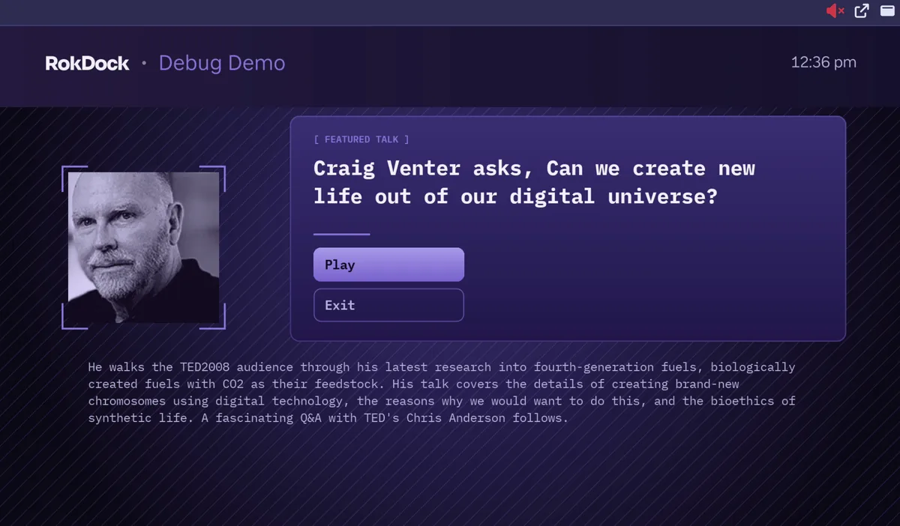

# HDMI Capture Preview for Roku

RokDock can display a live video feed from an HDMI capture device (a USB or HDMI capture card connected to your computer). This is distinct from the Roku device screenshot feature, which captures a still image over the network. See [Screenshot Preview](screenshot-preview.md) for that.

## Requirements

- An HDMI capture card or USB capture device connected to your computer
- The device must be recognized by your operating system before RokDock launches

## Camera and Microphone Permissions

Capture devices appear to the operating system as a camera (video) and, when they carry audio, a microphone. The first time RokDock opens a stream it may need permission to use them. If the preview stays black, the device list is empty, or audio never plays, an OS-level permission is usually the cause.

### macOS

macOS prompts for **Camera** and **Microphone** access the first time RokDock opens the stream. If you dismissed or denied the prompt, re-enable RokDock under **System Settings > Privacy & Security > Camera** (and **Microphone**), then restart the app.

If the prompt never appeared and the toggles are absent, quit RokDock and reset its permission state so the prompt can fire again:

```bash
tccutil reset Camera com.rokdock.app
tccutil reset Microphone com.rokdock.app
```

### Windows

Windows has no per-app prompt for a desktop app like RokDock. Access is controlled by a single system toggle. Open **Settings > Privacy & security > Camera**, make sure **Camera access** is on, and enable **Let desktop apps access your camera**. Repeat under **Settings > Privacy & security > Microphone**. No per-app entry for RokDock will appear in these lists; the desktop-apps toggle is what governs it.

### Linux

Linux has no permission prompt. Access is governed by device ownership: your user must be able to read the capture device (typically membership in the `video` group for `/dev/video*`), and audio flows through PulseAudio or PipeWire with no extra permission. If the device is present but RokDock cannot open it, confirm your user is in the `video` group (`groups`), then log out and back in.

## Selecting a Capture Device

Configure the capture device in **Settings > Capture**, under the **Live Capture** section. The dropdown lists all video input devices detected by your system. If no devices appear, the dropdown shows "No capture devices detected."


*Settings > Capture: device selection and idle timeout are in the Live Capture section; screenshot folder and filename format are in the Screenshot section above it.*

## Viewing Modes

The capture preview supports three viewing modes. Switch between them using the controls in the capture section toolbar.

### Docked

The default mode. The capture feed is embedded in the left or right side panel as a collapsible section labeled **Capture**.

Controls in the docked toolbar:

- **Volume** - opens a flyout with a vertical volume slider (0-100) and a mute toggle button
- **Swap side** - moves the capture between left and right panels
- **Float (PiP)** - converts to a floating overlay inside the main window
- **Settings** - opens the Capture settings tab

### PiP (Picture-in-Picture)

A floating overlay rendered inside the main window. It layers over all other content without opening a separate OS window.

- **Drag** the dot-grid toolbar at the top to reposition the overlay anywhere in the window
- **Resize** from any corner handle to adjust size (height is derived from the current aspect ratio)
- Position and size persist across sessions
- Controls in the PiP toolbar: volume flyout, pop out to a separate window, dock back to the panel

### Popout Window

Opens the capture feed in a dedicated frameless window.

Controls in the popout toolbar:

- **Volume** - opens a flyout with a vertical volume slider and mute toggle
- **Opacity** - opens a flyout with a vertical slider to adjust window transparency (minimum 10%)
- **Screenshot** - saves the current video frame as a PNG file
- **Always on top** - pins the popout window above all other windows
- **Fullscreen** - enters fullscreen mode (also toggled by double-clicking the video or pressing F11)
- **Close** - closes the popout and returns to docked mode

In fullscreen mode the toolbar hides automatically and reappears briefly when you move the mouse.


*The live HDMI capture feed as a Picture-in-Picture float over the dock. The same feed can also be docked in a side panel or popped out into its own window.*

## Audio

- Audio is muted by default
- Click the volume icon in any mode to open a flyout containing a vertical slider and a separate mute/unmute toggle
- Adjusting the slider to 0 automatically mutes; raising it above 0 automatically unmutes
- Mute state and volume level persist across sessions

## Aspect Ratio

Configure in **Settings > Capture > Live Capture**:

- **Auto (from device)** (default) - uses the native aspect ratio reported by the capture device
- **16:9** - forces widescreen ratio
- **4:3** - forces standard ratio

## Idle Timeout

To allow the screensaver to run, the capture stream pauses automatically after a period of inactivity.

Configure in **Settings > Capture > Live Capture** using the Idle Timeout dropdown. Available options: Never, 1 minute, 5 minutes, 10 minutes, 15 minutes, 30 minutes, 1 hour, 2 hours, 4 hours. The default is 1 hour.

When the stream is paused, a "Paused due to inactivity" message is shown. Moving the mouse or pressing a key resumes the stream. Idle timeout is suspended while the popout window is in fullscreen mode.

## Saving a Still Frame

The still-frame save button is available only in the popout window toolbar. Clicking it captures the current video frame and saves it as a PNG. The saved file uses a timestamp-based name (for example, `capture-2024-01-15T10-30-00-000Z.png`) and is downloaded directly from the popout window.

This is separate from the Roku device screenshot feature. The screenshot folder and filename format in **Settings > Capture > Screenshot** apply to device screenshots, not to capture card still frames.

## Persistence

The following capture preferences persist across sessions:

- Selected capture device
- Mute state and volume level
- Viewing mode (docked, PiP, popout)
- Dock side (left or right)
- PiP position and size
- Aspect ratio setting
- Idle timeout duration

## Related

- [Settings](settings.md) - capture device and preference configuration
- [Screenshot Preview](screenshot-preview.md) - Roku device screenshots (network-based, not HDMI capture)
- [Getting Started](getting-started.md) - main layout overview
