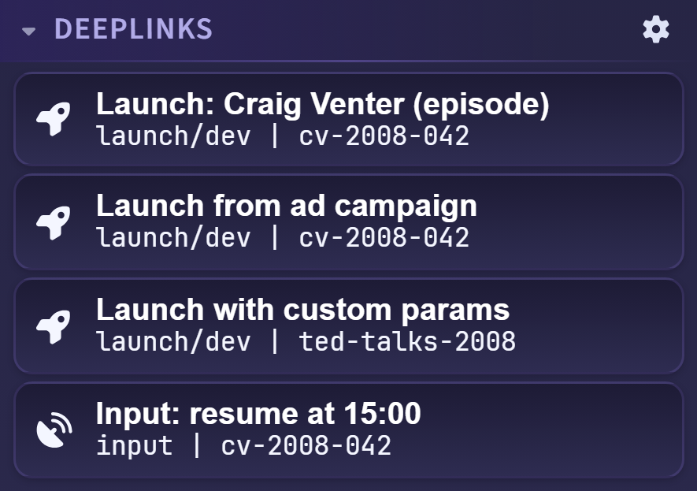

# Roku Deeplink Testing (Launch and Input Presets)

RokDock lets you configure reusable deeplink presets and fire them against a selected Roku device from the right panel.

## Where Deeplinks Are Used

- **Settings > Deeplinks**: create, edit, and delete deeplink definitions.
- **Right panel > Deeplinks**: launch configured entries against the selected remote device. This panel is read-only. Editing is done in Settings.

## Deeplink Types

Each entry has a type that determines the ECP command sent:

- **Launch**: sends an ECP `POST /launch/{appId}` command. Use this to cold-start a channel or deeplink into content.
- **Input**: sends an ECP `POST /input` command. Use this to pass parameters to a channel that is already running.

## Deeplink Fields

Every deeplink entry has the following fields:

| Field | Required | Notes |
|---|---|---|
| Display Name | No | Label shown in the panel button |
| Type | Yes | `Launch` or `Input` |
| App ID | Launch only | Channel ID to launch (defaults to `dev` when blank) |
| Media Type | No | Value passed as the `mediaType` query parameter |
| Content ID | No | Value passed as the `contentId` query parameter |
| Extra Parameters | No | Additional custom key/value query parameters |

The App ID field is only shown for Launch type entries. Input type entries have no app target.

## Configuring Deeplinks

Open **Settings > Deeplinks** to manage your presets. Changes are held as a draft until you click **Save**.

*The Settings > Deeplinks tab. Each card expands to reveal all fields for that entry.*

From this tab you can:

- Click **+ Add Deeplink** to create a new entry.
- Click a card header to expand or collapse its fields.
- Click the X button on a card header to remove that entry.
- Click **+ Add Parameter** inside an expanded card to add an extra key/value pair.
- Use **Import** and **Export** to transfer presets between machines (see [Import and Export](#import-and-export) below).

## Launching Deeplinks

*The Deeplinks panel with configured presets. Launch entries show a rocket icon, Input entries a satellite dish, and each button's meta line shows its ECP path and content ID.*

From the Deeplinks panel in the right rail:

- Click a preset button to send it to the selected device.
- Buttons are disabled (opacity reduced) when no remote target device is selected. Hovering a disabled button shows "Connect to a device first".
- Launch entries show a rocket icon. Input entries show a satellite dish icon.
- Each button shows a meta line with the ECP path (`launch/dev`, `input`) and the content ID if one is set.

To open the Deeplinks Settings directly, click the gear icon in the Deeplinks panel header.

## ECP URL Construction

RokDock builds the ECP request from the entry's fields. All keys and values are percent-encoded.

- **Launch type**: `POST http://{device}:8060/launch/{appId}?mediaType={mediaType}&contentId={contentId}&{extraParams}`
- **Input type**: `POST http://{device}:8060/input?mediaType={mediaType}&contentId={contentId}&{extraParams}`

Parameters with empty values are omitted from the query string. If App ID is blank on a Launch entry, RokDock uses `dev` as the fallback.

## Examples

### Launch a dev channel

- **Type**: Launch
- **App ID**: `dev`
- **Media Type**: (empty)
- **Content ID**: (empty)

Sends: `POST /launch/dev`

### Launch with content

- **Type**: Launch
- **App ID**: `dev`
- **Media Type**: `movie`
- **Content ID**: `abc123`
- **Extra params**: `showId` = `456`

Sends: `POST /launch/dev?mediaType=movie&contentId=abc123&showId=456`

### Send input to a running app

- **Type**: Input
- **Media Type**: `special`
- **Content ID**: `refresh`

Sends: `POST /input?mediaType=special&contentId=refresh`

## Import and Export

The Import and Export buttons at the bottom of the Deeplinks settings tab use the **RokuDeepLinking JSON format** (`{ "channels": [...] }`). This is the same format used by Roku's own deeplink testing tools, so presets can be shared across teams and machines.

**Import**: opens a file picker, parses the JSON, and appends the imported entries to your current list. All imported entries are given type `Launch`. Save the dialog to commit the import.

**Export**: serializes your current list to a timestamped `RokuDeepLinking_<timestamp>.json` file. The Export button is disabled when there are no entries to export.

Note: because the RokuDeepLinking format does not have a field for the Input type, exporting an Input entry and re-importing it will convert it to a Launch entry.

## Tips

- Keep names action-oriented (for example: "Launch Dev App", "Play Test Asset").
- Use extra parameters for app-specific QA or test hooks.
- Pair deeplinks with Device Properties credentials and the screenshot toolbar for repeatable test workflows.

## Troubleshooting

- If launches fail, verify the target device is selected in the Remote panel.
- Validate the App ID and any parameter names your app expects.
- Check device and app state if an Input deeplink appears to have no visible effect. The Input command only works when the target channel is already running.
