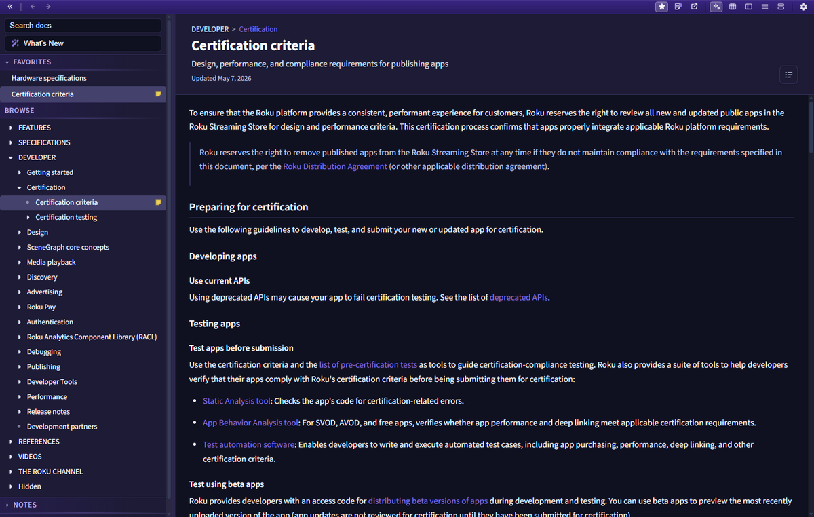
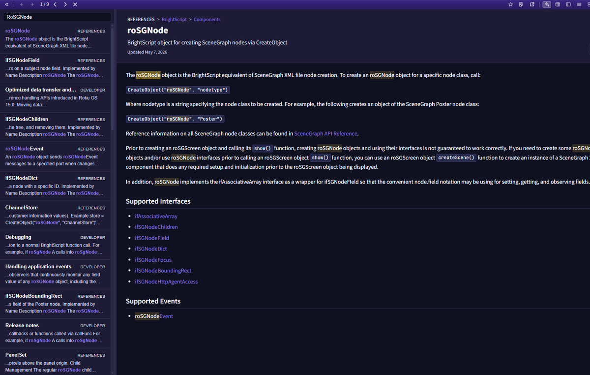
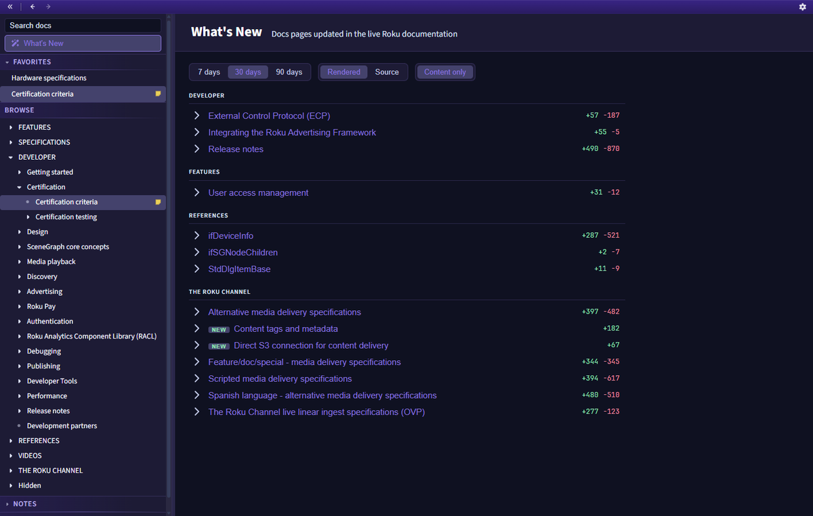

# Roku Developer Documentation Browser (Offline Capable)

The Developer Docs tool is an in-app browser for the official Roku developer documentation. It fetches the docs directly from the rokudev/dev-doc repository and renders them inside RokDock, so you can read reference material without leaving the app.

## Opening the Tool

**From the dock:** Open `Tools > Developer Docs` in the menu bar. The window opens alongside the dock.

**As a standalone tool:** Developer Docs also opens on its own, without the dock, via its installer shortcut or with `RokDock --tool docs`. See [Launching Tools Directly](getting-started.md#launching-tools-directly). Like the 9-Patch Editor, Developer Docs has no file association (it opens no files).

**From the terminal:** Select text in a terminal tab and choose "Look up in docs" from the selection toolbar to open Developer Docs with that term already searched. See [Terminal](terminal.md).

## Window Layout

*Developer Docs with the Browse tree expanded and a page open in the reading pane.*

The window has a brand-gradient toolbar across the top, a navigation sidebar on the left, and a reading pane on the right.

### Toolbar

- **Collapse sidebar** - hides or shows the navigation sidebar to give the reading pane more width.
- **Back / Forward** - browser-style history navigation. Also bound to `Alt+Left` / `Alt+Right` and the mouse back/forward buttons.
- **Favorite** - stars or unstars the current page (shown when a page is open).
- **Layout switcher** - changes how wide tables are rendered (shown when a page is open). See [Tables](#tables).
- **Settings gear** - opens the [Appearance](settings.md#appearance) settings for this window.

## Sidebar

From top to bottom, the sidebar contains:

### Search

*Full-text search results in the sidebar, with the matched term highlighted in each snippet.*

A full-text search box. Type a query and matching pages appear with the section name and a context snippet, with your terms highlighted. Press `Enter` to open the first result, or `Escape` to clear the box. The first search of a session builds a local index of every page (it shows "Building search index..."), which then makes later searches instant. Opening a result scrolls to and highlights the matched text and shows a floating find bar to cycle through matches (`F3` / `Shift+F3`).

Search runs entirely against a local index built from the page content, not the GitHub search API, so it works against the same content you browse.

### What's New

*What's New groups changed pages by section and shows each page's added and removed line counts.*

Opens a feed of pages that changed in the official docs over a chosen window (7, 30, or 90 days). Each entry can be expanded to show the actual change as a diff, with a Rendered view (formatted markdown tinted for additions and removals) and a Source view (line-level tracked changes). A "Content only" toggle hides formatting-only changes so you see just the meaningful text edits. Click an entry's title to open that page.

### Favorites

Star any page (from the toolbar) to add it here for quick access across sessions. Click the star again to remove it.

### Browse

The full documentation tree. Top-level categories expand to reveal their pages, and clicking a page title loads it. Pages that have a note are marked.

### Frequently Viewed

Once you have opened some pages enough times, a Frequently Viewed section appears at the bottom for fast return to the pages you read most.

## Reading Pane

The reading pane renders the Markdown content from the official docs.

- **Theme matching.** The pane follows the current RokDock light/dark theme and updates live when you switch themes, with no need to reopen the window.
- **Code highlighting.** Code blocks are highlighted for BrightScript, JSON, XML, YAML, INI, bash/sh, C, JavaScript, and Python. HTTP and plain-text blocks render without coloring.
- **In-app navigation.** Links to other pages within the Roku developer docs navigate inside the reading pane. External links open in your default browser.
- **On this page.** A table-of-contents toggle in the page header opens a panel of the page's headings, with scroll-spy highlighting the current section. Click a heading to jump to it.
- **Copy code.** Code blocks have a copy button.
- **Reading-pane zoom.** `Ctrl/Cmd + =` / `-` / `0` scale the reading text independently of the window UI scale.
- **Reading position and notes.** The pane remembers your scroll position per page across sessions, and you can attach a per-page note that persists.
- **Last updated.** When available, a page shows when it was last changed in the official docs.

### Tables

Wide reference tables can be rendered in different layouts. The toolbar layout switcher chooses how the current page's tables are shown (a native side-by-side table, a stacked compact form, or a two-pane form for tables with long cells). RokDock can decide the best layout automatically per column, and your choice is remembered per page across sessions. Table columns can be resized by dragging a header border (double-click to auto-fit), and columns can be sorted by clicking a header.

### Quick Open

Press `Ctrl/Cmd + K` to open a quick-open palette over the reading pane. Type to filter the documentation tree by page title and press Enter to jump straight to a page. This is distinct from the sidebar full-text search (quick open matches titles only and is instant).

## Content, Caching, and Offline

Developer Docs keeps a persistent on-disk cache so pages you have read open instantly and remain available offline.

- On open, cached content is served immediately, then RokDock checks once per session whether the docs branch has new commits and quietly refetches only the pages that changed.
- The first time you use search, the full corpus is fetched in the background and cached, so subsequent reading and search are fast.
- If you are offline or a fetch fails, RokDock serves the last cached content. What's New shows a banner noting it is displaying the last cached changes when it cannot reach GitHub.

## Related

- [Getting Started](getting-started.md) - installation, first launch, UI overview
- [Terminal](terminal.md) - the "Look up in docs" selection action
- [Settings](settings.md) - appearance settings for tool windows
