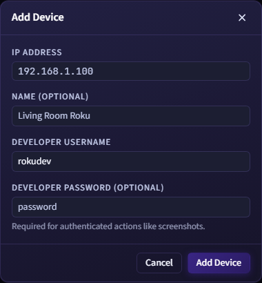

# Roku Device Discovery and Developer Mode

This page covers Roku device discovery, manual devices, connection behavior, and device-level settings.

## Device Discovery

RokDock discovers Roku devices on your local network with SSDP.

- Discovery runs continuously and can be refreshed manually.
- Use the refresh button in the Devices panel header to trigger an immediate scan.
- Discovery behavior is configurable in **Settings > Devices**:
  - **Scan Interval**: 30s to 600s (default: 60s)
  - **Request Timeout**: 1000ms to 15000ms (default: 5000ms)

## Manual Devices

Use **Add Device** from the Devices panel to add a device by IP address. This is useful when SSDP multicast is blocked or the device is on a different subnet.

*Add Device dialog. Fill in at minimum the IP address; enter credentials to enable authenticated actions.*

The Add Device dialog fields:

- **IP Address** (required, IPv4 format)
- **Name** (optional display name)
- **Developer Username** (defaults to `rokudev`)
- **Developer Password** (optional, but required for authenticated actions like screenshots)

If a password is provided, a username is also required. RokDock stores credentials encrypted for use in authenticated operations.

*An expanded device card: online dot, model, IP, per-port connect buttons, and the device actions.*

## Device Card Details

Each device card shows:

- Reachability indicator (online/offline)
- Display name (nickname if set, otherwise device name)
- Model label (shows "Manual" for uncredentialed manual entries, or "Authenticated" once credentials are saved)
- IP address

Behavior details:

- A device can be marked stale if not seen recently (see Device Status Indicators below).
- Cards expand/collapse to reveal actions.
- Cards support drag-and-drop reordering.
- Drag-and-drop reordering shows visual feedback: the dragged card shifts and other cards slide to indicate the drop position.

An accent bar below the panel header shows the number of active terminal connections (for example, "2 active connections").

## Developer Mode Indicator

Device cards show a lock/unlock icon when Roku Developer Mode is detected:

- **Unlock icon** (green, with glow): developer mode is enabled and credentials are stored
- **Lock icon** (muted): developer mode is enabled but no credentials are set

The icon does not appear for devices where developer mode has not been detected.

## Card Actions

When expanded, a card provides:

- **Port connect actions** (one button per enabled port)
- **Connect Remote Panel**
- **Sideload App...** - upload a `.zip` channel package to the device (requires developer credentials; see [Sideloading](sideload.md))
- **Properties...**
- **Remove Custom Device...** (manual-only devices that have not been seen via SSDP)

The Sideload App option is dimmed when developer credentials are not configured, or when developer mode is not detected on the device.

Connecting to a port opens a new terminal tab and records that device as most recently connected.

## Ordering Rules

Device order is persistent.

- Drag-and-drop reorders and saves order.
- Connecting to a device moves that device to the top.
- Devices with developer mode disabled sort after all developer-enabled devices.
- Discovery refresh does not reorder the list unexpectedly.

## Device Properties

Open **Properties...** from a device card.

**Editable fields:**

- Friendly name (nickname override)
- Developer username
- Developer password (hold the eye button to reveal)

Developer credentials are grouped under a collapsible **Developer Credentials** section that shows the current developer mode and credential status.

**Read-only device info (under Device Info):**

- Name
- Model
- Model Number
- Code name
- Serial Number
- Software Version
- IP Address
- Location (clickable, opens in browser)

### Credential Storage

Developer credentials (username and password) are encrypted at rest using Electron's `safeStorage` API when available on the platform. Credentials are required for authenticated operations such as screenshot capture.

## Device Status Indicators

Each device card shows a status dot:

- **Green dot** (with glow): device is online and reachable
- **Gray dot**: device is offline, unreachable, or stale

A device is marked stale if it has not responded to discovery for approximately 45 seconds.

## Port Configuration

Configure ports in **Settings > Devices**.

*Settings > Devices tab. Manage debug ports, tune SSDP discovery timing, and view configured devices.*

Each port entry has:

- Color
- TCP port number
- Label
- Enabled toggle

Default ports:

- `8085` - BrightScript Debug
- `8080` - Commands
- `8087` - Screensaver

Only enabled ports appear as connect actions on device cards.

## Troubleshooting

- If a device does not appear, verify it is on the same network segment as the machine running RokDock.
- If discovery is slow or misses devices, increase the request timeout in **Settings > Devices**.
- If authenticated features fail, verify credentials in **Properties...** for the device.
- If a manual entry conflicts with discovery, remove it and re-add it with the correct IP and credentials.
