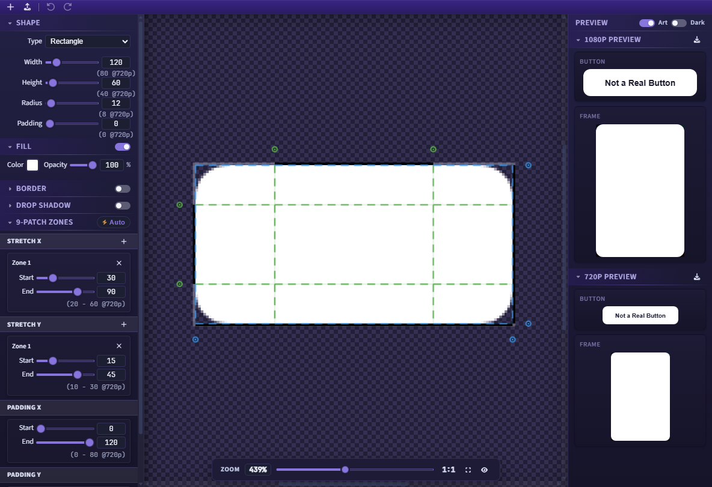

# 9-Patch Editor

RokDock includes a built-in 9-patch image editor for creating and editing stretchable `.9.png` assets used in Roku SceneGraph development.

*The 9-Patch Editor: shape canvas with zone guides (center), property panels (left), and live 1080p/720p previews (right).*

## What Is a 9-Patch Image?

A 9-patch (or nine-patch) is a PNG image with a 1-pixel border that defines stretchable regions and content padding. Roku SceneGraph uses 9-patch images for scalable UI elements like buttons, frames, and dialog backgrounds. The border pixels encode which parts of the image stretch and where content sits.

## Opening the Editor

Open from **Tools > 9-Patch Editor** in the menu bar. The editor opens in a separate window. It also opens on its own outside the dock, via its installer shortcut or with `RokDock --tool ninepatch [path]`. There is no file association for 9-patch images: open the editor first, then import the image. See [Launching Tools Directly](getting-started.md#launching-tools-directly).

## Window Layout

The editor uses a three-panel layout:

- **Left panel** (240px): Shape and zone configuration with collapsible sections
- **Center**: Editor viewport with canvas, zoom controls, and pixel inspector
- **Right panel**: Live 1080p and 720p previews with export buttons

## Toolbar

- **New** (`Ctrl+N`): creates a new blank 9-patch with default rectangle shape (120x60px)
- **Import** (`Ctrl+O`): loads a PNG/JPEG image or existing `.9.png` file
- **Undo** (`Ctrl+Z`): reverts last change
- **Redo** (`Ctrl+Y` or `Ctrl+Shift+Z`): reapplies last undone change
- **Filename**: displays the imported filename (right side of toolbar)

## Left Panel - Configuration

All sections are collapsible. Numeric inputs show 720p equivalents below each value.

### Shape

Controls the base shape when creating from scratch. When editing an imported image, these controls are disabled (dimmed) but remain visible.

- **Type**: Rectangle or Ellipse
- **Width**: 4-2,000px (slider range 4-800)
- **Height**: 4-2,000px (slider range 4-800)
- **Radius**: 0-500px (slider range 0-400) - hidden for Ellipse
- **Padding**: 0-200px (slider range 0-100) - outer padding around the shape

### Fill

Toggle on/off to enable or disable fill.

- **Color**: color picker (default: white `#FFFFFF`)
- **Opacity**: 0-100% (default: 100%)

### Border

Collapsed by default. Toggle on/off.

- **Color**: color picker (default: black `#000000`)
- **Opacity**: 0-100% (default: 100%)
- **Width**: 0-100px (slider range 0-50)

### Drop Shadow

Collapsed by default. Toggle on/off.

- **Color**: color picker (default: black `#000000`)
- **Opacity**: 0-100% (default: 50%)
- **X Offset**: -200 to +200px (slider -100 to +100, default: 0px)
- **Y Offset**: -200 to +200px (slider -100 to +100, default: 4px)
- **Blur**: 0-200px (slider 0-100, default: 8px)

### 9-Patch Zones

Define stretch and padding zones for the 9-patch image.

**Auto-detect** button: analyzes the image to automatically generate zones.
- For rectangles and rounded rectangles in shape mode: calculates zones analytically from the shape geometry and shadow envelope.
- For ellipses in shape mode and for all imported images: scans opaque pixels to find the widest fully-opaque row/column spans.

**Stretch X / Stretch Y zones** (add/remove dynamically):
- Each zone has Start and End values (range sliders plus number inputs)
- Minimum 1px between start and end
- Add button creates a new zone at approximately 50% of the dimension

**Padding X / Padding Y**:
- Start and End values define the content padding region

All zone inputs support mouse wheel adjustment (+/-1 per notch, +/-10 with Shift held).

## Center - Editor Viewport

### Canvas

- Checkerboard transparency background
- Pixel-perfect rendering at current zoom level
- Click-and-drag to pan when zoomed in

### Zone Overlay

When guides are visible:

- **Stretch zones**: colored dashed lines with circular drag handles (green, cyan, orange, pink cycle)
- **Padding zones**: blue dashed lines with drag handles
- Drag handles to adjust zone boundaries in real-time
- Cursor changes to `ew-resize` (horizontal) or `ns-resize` (vertical) over handles

### Zoom Dock

Floating dock at bottom center:

- **Zoom pill**: displays current percentage
- **Zoom slider**: 10-1000% range
- **1:1 button**: resets to 100% and centers canvas
- **Fit to window**: calculates optimal zoom with margin
- **Show/Hide guides**: toggles zone overlay visibility
- `Ctrl + mouse wheel` zooms in/out (~15% per step, multiplicative)
- Snaps to 100% when within +/-3%

### Pixel Inspector

Appears in the zoom dock when hovering over the canvas:

- Shows pixel coordinates (X, Y)
- Displays RGBA values
- Color swatch preview

### Empty State

Before any asset is loaded, the viewport shows: "No Asset Loaded" with hint text "Adjust shape parameters in the left panel, or import an existing image."

## Right Panel - Preview

### Preview Controls

The preview panel header contains two toggles:

- **Art**: shows or hides fake poster art inside the frame preview to simulate content behind a frame asset.
- **Dark / Light**: toggles the preview background between dark and light.

### 1080p Preview

- **Export button**: exports the 1080p file only. To export both resolutions at once, use `Ctrl+S` or File > Export 9-Patch (see [Export](#export))
- **Button preview**: 189x45px stretched sample with placeholder label
- **Frame preview**: 147x221px stretched sample with optional poster art

### 720p Preview

- **Export button**: exports the 720p file only (opens a separate save dialog)
- **Button preview**: 126x30px (2/3 scale)
- **Frame preview**: 98x147px (2/3 scale)
- All zone coordinates automatically scaled by 2/3

Previews update in real-time as zones are edited. A red warning appears if the target preview size is smaller than the image's minimum stretchable size.

## Import

- Accepts PNG, JPG, and JPEG files
- `.9.png` files: automatically detects and populates stretch and padding zones from the 9-patch border markers, then strips the 1px border for editing
- Regular images: zones start empty; use auto-detect or add manually

## Export

**Paired export** (`Ctrl+S`, or File > Export 9-Patch): opens a single Save dialog defaulting to `{basename}_fhd.9.png`. After you confirm the 1080p filename, the 720p file is saved automatically alongside it with `_fhd` replaced by `_hd` in the filename. You are not prompted a second time.

**Single-resolution export**: the 1080p export button saves only the 1080p file (defaulting to `{basename}_fhd.9.png`), and the 720p export button saves only the 720p file (defaulting to `{basename}_hd.9.png`). Each opens its own Save dialog.

Both variants:
- Strip any existing `_fhd` or `_hd` suffix from the source filename before building the default name.
- Add a standard 9-patch 1px border with zone markers:
  - Top edge: horizontal stretch (stretch X) markers
  - Left edge: vertical stretch (stretch Y) markers
  - Bottom edge: horizontal content (padding) markers
  - Right edge: vertical content (padding) markers

## Undo/Redo

All changes are tracked: shape parameters, fill/border/shadow toggles, zone edits, auto-detect operations, and imports. History is capped at 100 steps per session. History resets on **New**.

## Context Menu

Right-click in the editor for:

- Import Image...
- Export 9-Patch...
- Undo (`Ctrl+Z`)
- Redo (`Ctrl+Y`)

## Keyboard Shortcuts

| Shortcut | Action |
|----------|--------|
| `Ctrl+N` | New |
| `Ctrl+O` | Import image |
| `Ctrl+S` | Export (paired 1080p + 720p) |
| `Ctrl+Z` | Undo |
| `Ctrl+Y` / `Ctrl+Shift+Z` | Redo |
| `Ctrl + scroll` | Zoom in/out |

## 720p Equivalents

All pixel values in the left panel display their 720p equivalent below the input, calculated as `round(value * 2/3)`. This helps you design for both resolutions simultaneously.

## Theme Integration

The editor follows the app's current light/dark theme mode.

## Related

- [Settings](settings.md) - general app configuration
- [Keyboard Shortcuts](keyboard-shortcuts.md) - full shortcut reference
