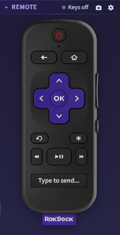
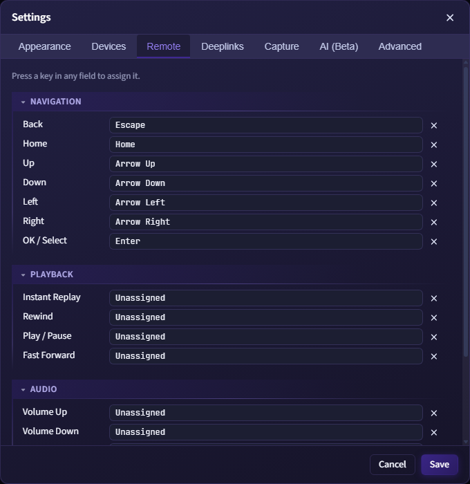

# Remote Control

RokDock includes a virtual Roku remote panel on the right side of the app.

## Device Selection

At the top of the panel, choose the target device from the device dropdown.

- Remote commands and deeplink launches use this selected device.
- Opening a terminal tab for a device usually aligns remote target selection to that device.

*The Remote panel with a device selected. The on-screen remote is active and ready to send ECP commands.*

## On-Screen Remote Buttons

The remote surface provides clickable hotspots for:

- Power
- Back
- Home
- Up / Down / Left / Right
- OK / Select
- Instant Replay
- Options
- Rewind
- Play / Pause
- Fast Forward
- Volume Up
- Volume Down
- Mute

## Keyboard Mode

Click inside the remote panel (outside text fields) to activate keyboard control mode. A small status indicator in the Remote section header shows whether keyboard shortcuts are active ("Keys on") or inactive ("Keys off"). When no device is selected it shows "No device".

When focused, bound keys trigger remote actions.

Default key bindings:

| Action | Default key |
|---|---|
| Back | `Escape` |
| Home | `Home` |
| Up | `Arrow Up` |
| Down | `Arrow Down` |
| Left | `Arrow Left` |
| Right | `Arrow Right` |
| OK / Select | `Enter` |

All other actions (Power, Instant Replay, Options, Rewind, Play/Pause, Fast Forward, Volume Up, Volume Down, Mute) have no default binding. You can assign keys to them in **Settings > Remote**.

All key bindings are configurable. Open Settings > Remote from the gear icon in the Remote section header, or from the main Settings dialog.

*The Settings > Remote tab. Click any row to record a new key for that action.*

## Text Entry Overlay

A text entry zone in the remote panel sends key/text input to Roku via ECP:

- Arrow keys map to directional keys
- Enter maps to Select
- Escape maps to Back
- Backspace sends Backspace
- Character keys send text directly

## Screenshot Capture

Use the camera button in the Remote section header to capture a screenshot from the selected device.

Requirements:

- A device must be selected (the button is disabled with no device selected)
- Developer credentials must be configured for the device (if credentials are missing or invalid, a toast appears after the attempt with a "Set credentials" quick action)

Screenshots are only available when the device's active app is the sideloaded `dev` channel. If a different app is active, the capture fails with a message saying so. The camera button tooltip shows the current active app context.

Successful capture opens a dedicated preview window. See [Screenshot Preview](screenshot-preview.md) for full details on zoom, auto-refresh, comparison overlays, measurement tools, and history.

## Active App Polling

The remote panel polls active app state on an interval.

- Configurable in **Settings > Advanced**
- Range: 500ms to 15000ms
- Default: 3000ms

## Related Panels

The Scripts and Deeplinks panels appear directly below the remote inside the same right-side panel. All three share the same selected device target. See [Deeplinks](deeplinks.md) for details on the deeplink launcher.

## Troubleshooting

- If button presses do nothing, confirm a target device is selected.
- If screenshot fails with a credentials error, use the "Set credentials" quick action in the toast, or open Device Properties and enter the developer username and password.
- If keyboard controls do not respond, click the remote panel background to restore keyboard focus. The status indicator will switch to "Keys on" when focus is active.
