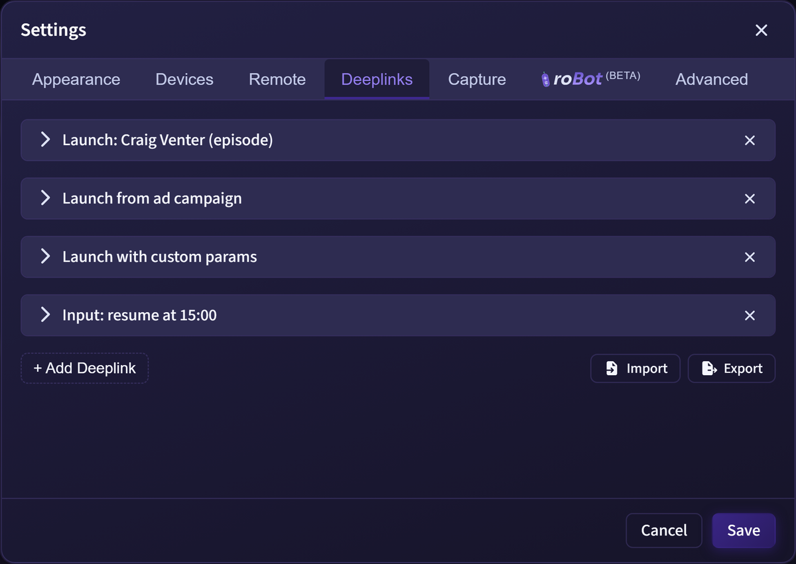
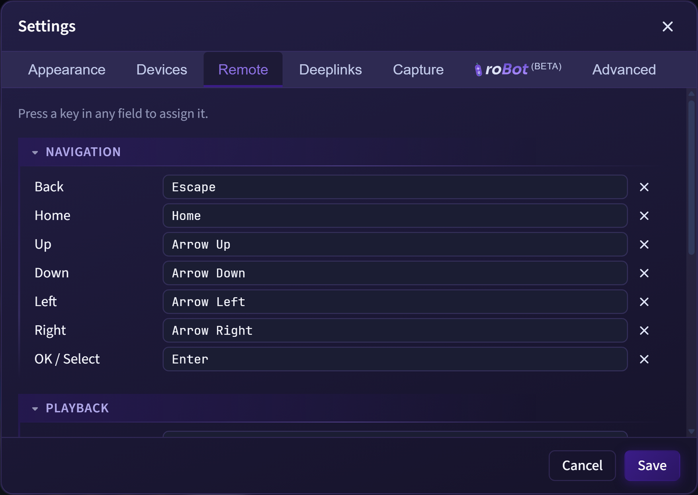
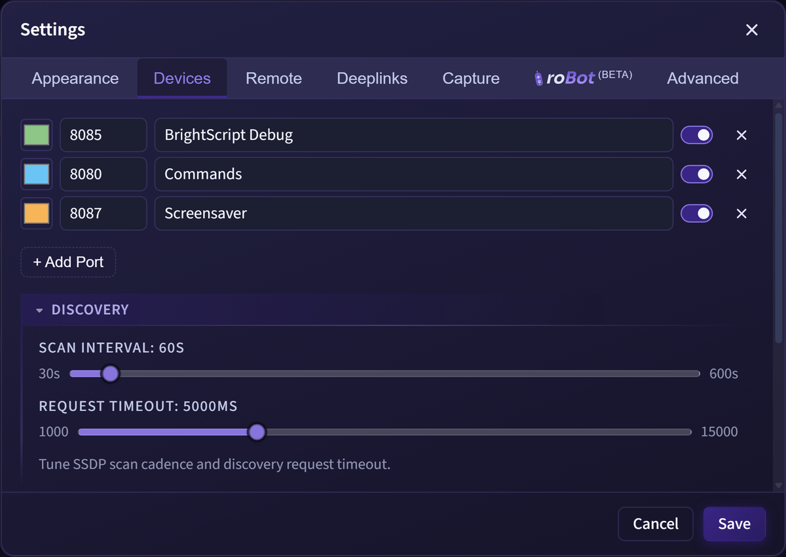
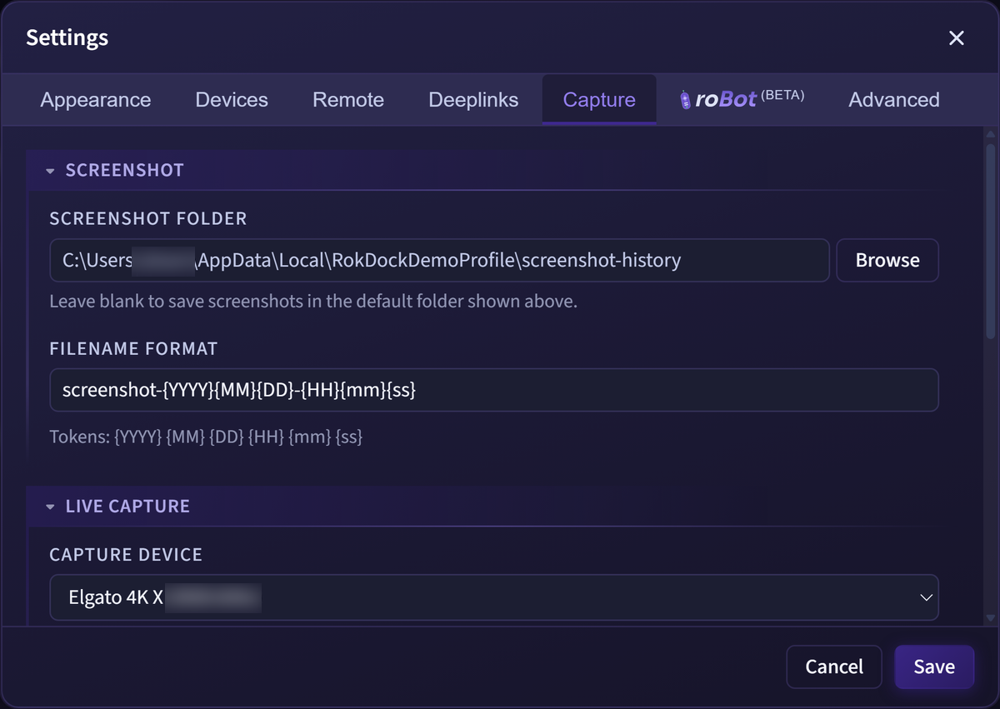
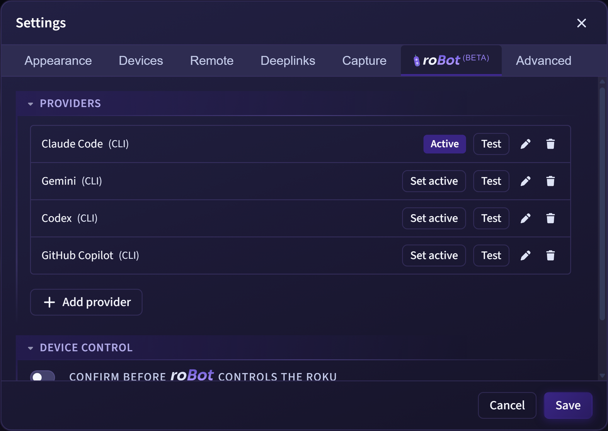
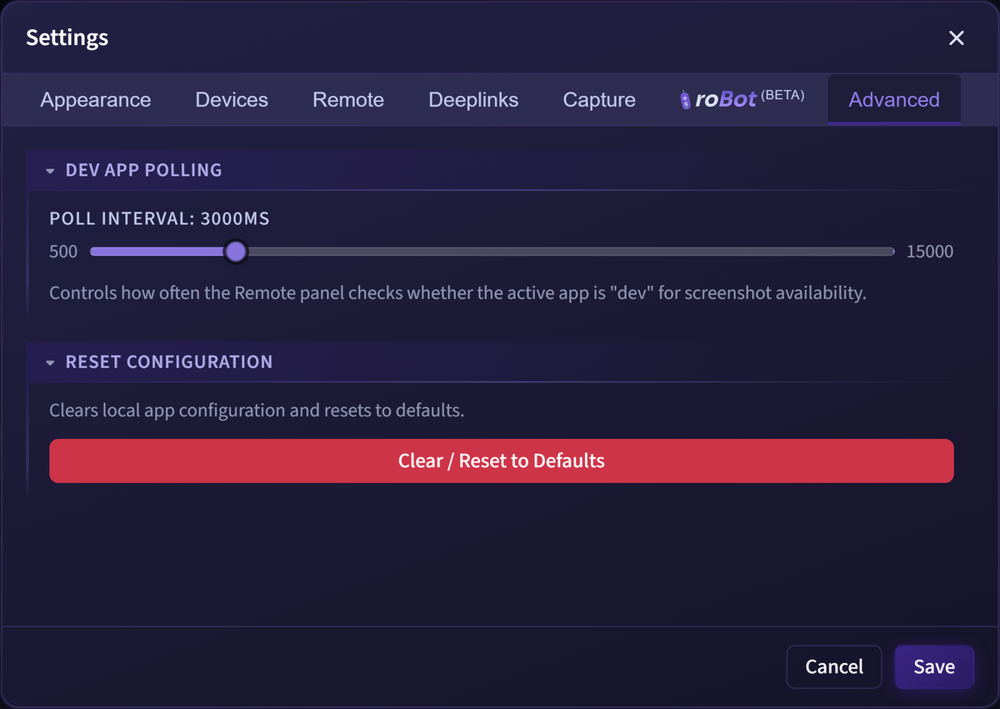

# Settings Reference

Open Settings from:

- `File > Settings...`
- `Ctrl/Cmd + ,`
- Gear buttons in the Terminal, Devices, Remote, Deeplinks, and Capture areas

Gear buttons appear in several panel headers and open Settings to the relevant tab. The Devices, Remote, Deeplinks, and Capture gears open their matching tabs. The terminal tab bar gear opens the **Appearance** tab scrolled to its Terminal section.

Settings are grouped into seven tabs: Appearance, Devices, Remote, Deeplinks, Capture, AI (Beta), and Advanced. Edits in the dialog are held as a draft and applied only when you click **Save**. Appearance changes preview live across all windows while the dialog is open and revert on Cancel.

## Appearance

*Appearance tab: theme mode, UI scale, color tint, and the shared Code and Terminal sections.*

The Appearance tab is the single home for all styling. It has a universal **Theme** section plus context-gated **Code** and **Terminal** sections.

### Theme

- **Theme mode** - a Light / System / Dark segmented control. **System** follows the operating system light/dark setting and flips live when the OS theme changes.
- **UI scale** - a slider that scales the whole interface (it adjusts the window zoom level, so terminal output and canvases scale too).
- **Color adjustments** - Hue, Saturation, and Brightness sliders that apply a tint to the UI accent, background, text, and border tokens. A swatch strip previews the result. Status colors (error/success/warning), syntax palettes, and anything rendered into a screenshot stay true so inspected pixels are never recolored.
- **Reset** (top-right of the section) returns UI scale and color adjustments to their defaults.

### Code

The Code section controls the monospace surfaces shared by the terminal and the JSON Viewer:

- **Font Family** - choose from a preset list of monospace fonts, or select "Custom..." to type a CSS font-family string. Default is the system monospace stack.
- **Font Size** - range slider from 8 to 24 px.
- **Syntax Theme** - preset dropdown grouped into No colorization, RokDock (RokDock Dark, RokDock Light), and a Popular set (Atom One Dark/Light, One Light, One Dark Pro, Dracula, Nord, Solarized Dark/Light, Monokai, Tokyo Night, Tokyo Night Day, GitHub Dark/Light, Gruvbox Dark/Light, Catppuccin Mocha, Catppuccin Latte).
- **Use theme background color** - toggle. Off by default so the terminal and JSON Viewer backgrounds stay aligned with the RokDock UI.
- **Text Color** - color picker shown only when "No colorization" is selected. Sets the monochrome fallback text color.
- **Live preview** - a sample BrightScript snippet rendered with the current font and theme so you can validate readability before saving.

See [Themes](themes.md) for the full preset list and background behavior.

### Terminal

- **Tab Label Format** - controls how terminal tabs are labeled:
  - **Display Name (Port)** - the device nickname followed by the port label (e.g., "Living Room (BrightScript Debug)")
  - **IP Address:Port** - the raw connection address (e.g., "192.168.1.50:8085")

## Deeplinks

*Deeplinks tab: manage, import, and export saved deeplink entries.*

Manage saved deeplink definitions used by the Deeplinks panel:

- Add or remove entries with **+ Add Deeplink** and the remove button on each card.
- Expand a card to configure:
  - **Display Name** - label shown in the Deeplinks panel.
  - **Type** - Launch or Input.
  - **App ID** - channel ID to target (shown only for Launch type, defaults to `dev`).
  - **Media Type** - `mediaType` parameter value.
  - **Content ID** - `contentId` parameter value.
  - **Extra Parameters** - additional key/value pairs appended to the launch command. Use **+ Add Parameter** to add rows.
- **Import** - load entries from a RokuDeepLinking JSON file, appending them to the current list.
- **Export** - save the current list to a timestamped RokuDeepLinking JSON file.

See [Deeplinks](deeplinks.md) for full details on launching and the panel workflow.

## Remote

*Remote tab: keyboard bindings for each Roku remote button.*

Configure which keyboard key triggers each remote action. Actions are grouped into four collapsible sections:

- **Navigation** - Up, Down, Left, Right, Select, Back, Home
- **Playback** - Rev, Play, Fwd, InstantReplay
- **Audio** - VolumeUp, VolumeDown, VolumeMute
- **System** - PowerOff, Info

To assign a binding: click the input for an action and press the desired key. To clear a binding: click the X button next to the input.

See [Remote Control](remote-control.md) for details on using the virtual remote.

## Devices

*Devices tab: port configuration, discovery tuning, and configured device list.*

### Ports

Each row represents one Telnet connection port. Ports drive the colored status dots on device cards and the connection options in the terminal dropdown.

- Add a row with **+ Add Port** and remove with the X button.
- Configure per row: color swatch, port number, display label, and enabled toggle.

### Discovery

Expand the **Discovery** section to tune SSDP scanning:

- **Scan Interval** - how often RokDock broadcasts an SSDP search. Range: 30 to 600 seconds (default 60 seconds).
- **Request Timeout** - how long each SSDP request waits for a response. Range: 1000 to 15000 ms (default 5000 ms).

### Configured Devices

Expand the **Configured Devices** section to view and manage devices that have a manual entry, saved credentials, or both. Auto-discovered devices without saved auth do not appear here.

- Click **Add** to open the Add Device dialog and register a device by IP address.
- Click the arrow button next to a device to open Device Properties, where you can edit the nickname and developer credentials.
- Click the X button to remove a device. Only manually added devices can be removed. Auto-discovered devices are removed automatically when they go offline.

See [Devices](devices.md) for the full discovery and manual device workflow.

## Capture

*Capture tab: screenshot output and live capture device settings.*

### Screenshot

- **Screenshot Folder** - path where screenshots are saved. Leave it blank to use the default folder, whose full path is shown in the field so you can find it. **Browse** opens the folder currently in effect (your chosen folder, or the default when blank).
- **Filename Format** - template for screenshot filenames. Supported tokens: `{YYYY}` `{MM}` `{DD}` `{HH}` `{mm}` `{ss}`. Default: `screenshot-{YYYY}{MM}{DD}-{HH}{mm}{ss}`.

### Live Capture

- **Capture Device** - select the video input device (e.g., an HDMI capture card) from the list of devices detected by the OS. The list updates automatically when devices are connected or disconnected.
- **Aspect Ratio** - how the capture frame is displayed. Options: Auto (from device), 16:9, 4:3.
- **Idle Timeout** - pauses the capture stream after a period of inactivity, allowing the device screensaver to run. Options: Never, 1 minute, 5 minutes, 10 minutes, 15 minutes, 30 minutes, 1 hour, 2 hours, 4 hours. Default: 1 hour.
- **Live preview** - when a capture device is selected, a preview of the live feed is shown at the bottom of this section.

## AI (Beta)

*AI (Beta) tab: the provider list with the add-provider form open.*

Configure the AI providers that power the [roBot](ai.md) panel and the terminal "Ask roBot" action. The tab opens to a provider list with the form hidden, so it starts as a clean list. roBot uses the single provider marked **Active**, so you must set one active for AI to work. Adding your first HTTP provider activates it automatically, but auto-detected CLI providers are listed without being activated, so click **Set active** on the one you want.

- **Providers list** - each saved provider shows its name, type, whether a key is stored, and which one is **Active**. Use **Set active** to switch, **Test** to run a Test Connection (a canned prompt streamed through the real engine, with the redaction preview shown beneath), the pencil to edit, and the trash to remove.
- **Add provider** - opens the form. Choose a **Provider type**: Anthropic (Claude), Gemini, OpenAI-compatible, or one of the recognized CLIs (Claude, Copilot, Gemini, Codex). HTTP providers take a name, model, optional base URL, and API key. A CLI provider is keyless and local, and is identified by the CLI name.
- **API Key** - stored encrypted on this machine via your OS keychain and never shown again after saving. Editing a provider and leaving the key blank keeps the stored key.
- **Local (no data leaves this machine)** - mark a provider that runs locally (an Ollama CLI or a localhost endpoint). A local provider needs no key, and redaction is optional because nothing leaves the machine.
- **Redact sensitive values** - on by default. Removes device IPs, names, and serial numbers from prompts before they are sent, with a before/after example shown inline. If you turn redaction off on a non-local (remote) provider, the form shows a red warning and an "I understand" acknowledgment you must check before Save is enabled.

See [roBot](ai.md) for using the assistant. The AI key provisioning workflow is handled separately from this settings tab.

## Advanced

*Advanced tab: dev app polling interval and configuration reset.*

### Dev App Polling

Controls how often the Remote panel checks whether the active app running on the device is the sideloaded dev channel. This check governs screenshot availability in the Remote panel.

- Range: 500 to 15000 ms
- Default: 3000 ms

### Reset Configuration

Click **Clear / Reset to Defaults** to open a confirmation dialog. The reset clears saved settings, appearance, device nicknames, custom device entries, auth credentials, AI providers and their saved keys, panel state, screenshot history, and comparison overlay history (including copied overlay files). The renderer reloads after the reset.

Optional checkboxes in the confirmation dialog:

- **Also delete all saved Deeplinks** - permanently removes all deeplink entries.
- **Also delete all saved Scripts** - permanently removes all saved scripts.
- **Also reset Screenshot folder to default** - shown only when a custom screenshot folder is configured.

## Persistence

RokDock persists settings via `electron-store` (`rokdock-config`).

Persisted categories include:

- panel state
- terminal preferences
- appearance (theme mode, UI scale, color tint, code font and syntax theme)
- discovery intervals
- remote bindings
- port and deeplink config
- device nicknames and auth
- command history
- capture device and preferences
- AI provider profiles (API keys are stored encrypted in a separate file)

## Related

- [Terminal](terminal.md) - terminal-specific behavior and tab indicators
- [Themes](themes.md) - full theme preset list and font options
- [Devices](devices.md) - discovery and manual device workflows
- [Remote Control](remote-control.md) - virtual remote and screenshot capture
- [Deeplinks](deeplinks.md) - deeplink configuration and launching
- [AI Chat](ai.md) - the assistant powered by the AI providers configured here
