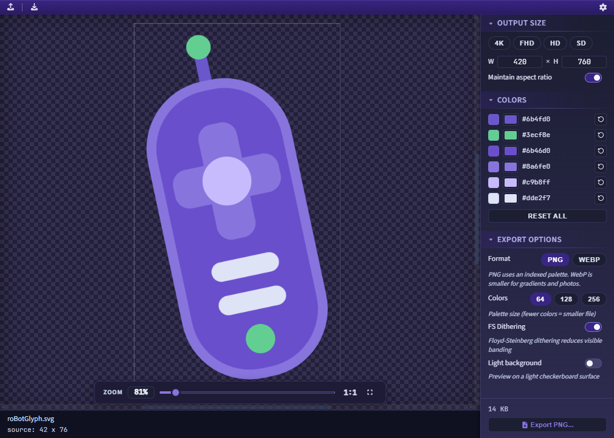
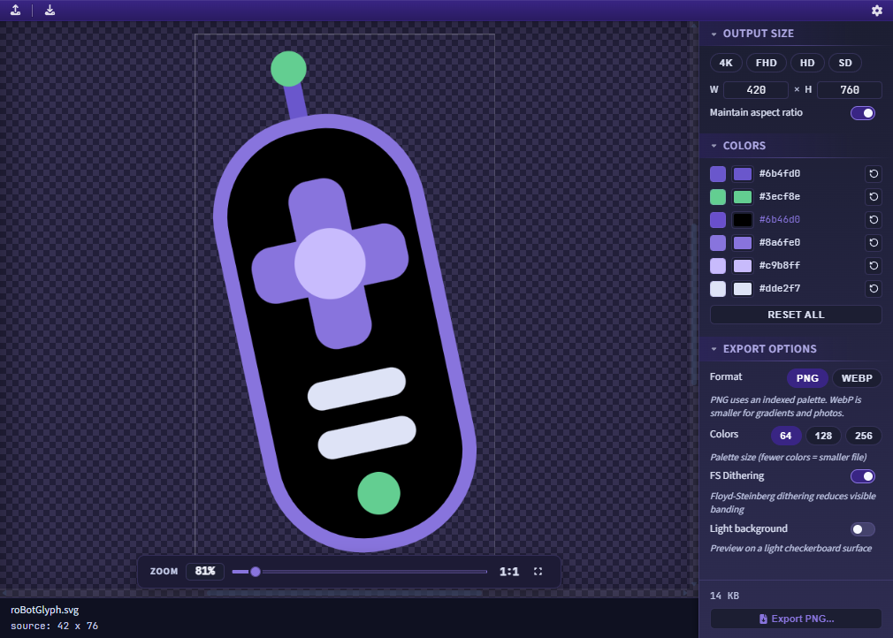

# SVG to Roku-Ready PNG Converter

RokDock includes an SVG-to-PNG converter for preparing vector assets for Roku SceneGraph development. The converter rasterizes an SVG at a chosen resolution, reduces it to an indexed color palette sized for Roku, and saves the result as a PNG.

*SVG Converter in its empty state, before an SVG file is loaded.*

## Opening the Converter

Open from **Tools > SVG Converter** in the menu bar. The converter opens in a separate window. It also opens on its own outside the dock, via its installer shortcut, by double-clicking a `.svg` file, or with `RokDock --tool svg [path]`. See [Launching Tools Directly](getting-started.md#launching-tools-directly).

## Importing an SVG

There are three ways to load an SVG file:

- Click anywhere on the drop zone ("Drop an SVG file here / or click to browse") to open a file picker.
- Drag an SVG file from your file manager and drop it onto the drop zone.
- Use **File > Import SVG...** (`Ctrl+O` / `Cmd+O`) from the converter's own menu bar.

After loading, the filename and intrinsic source dimensions appear in the footer below the preview. The Output Size and Export Options controls become active, and a Colors section appears when the SVG contains recolorable colors.

## Window Layout

- **Toolbar** (top): an Import button (upload icon) and an Export PNG button (download icon), plus the loaded filename.
- **Preview** (left): the drop zone before any file is loaded; the rendered canvas and zoom dock after loading.
- **Config panel** (right, 220 px): Output Size, Colors, and Export Options sections, plus the Export PNG button and estimated file size.

## Output Size

Choose a preset or enter custom dimensions:

- **4K** - intrinsic SVG width and height scaled by 2x.
- **FHD** - intrinsic SVG dimensions at 1x (native size).
- **HD** - intrinsic SVG dimensions at approximately 0.67x (720-line equivalent).
- **SD** - intrinsic SVG dimensions at approximately 0.44x (480-line equivalent).

For custom dimensions, type directly into the W and H fields (1 to 7680 x 1 to 4320). Editing either field deselects the presets, so the output uses exactly the values you enter.

The W and H fields default to 1920 x 1080 before an SVG is loaded. Once an SVG is loaded, selecting FHD sets the output to the SVG's actual intrinsic dimensions.

## Recolor

The Colors section lets you override the colors of an imported SVG before it is rasterized, so the change flows through to the quantized preview and the exported PNG.

*Recoloring an imported SVG. Each detected color shows its original swatch, a picker for the new value, and a reset button, and the change flows through to the preview and the exported PNG.*

When an SVG is loaded, RokDock scans it for the distinct fill and stroke colors it uses and lists each one:

- **Original swatch** (left) - the color as it appears in the source file.
- **Color picker** - click to choose a replacement color.
- **Hex label** - the original color value, highlighted when an override is active.
- **Reset** (circular arrow) - revert that single color to the original.

A graphic that uses `currentColor` (common in icon sets, where the color is normally inherited from the surrounding text) gets its own **currentColor** entry. A standalone SVG has no surrounding text to inherit from, so `currentColor` rasterizes as black by default. Use this entry to set the color it should take.

**Reset all** reverts every override at once. The section appears only when the loaded SVG contains recolorable colors.

Malformed colors are listed as what they actually render as. Some tools (Figma among them) can export an invalid value such as a 7-digit hex; the renderer falls back to the property's default (black for a fill, so the shape appears black), and RokDock lists that rendered black as a swappable color so you can correct it. An invalid stroke renders as no stroke and is not listed.

Note: colors set through `fill` and `stroke` attributes or inline styles are listed individually. Colors defined only inside a `<style>` block in the SVG are not listed separately, though `currentColor` is still handled for them.

## Export Options

- **Colors**: choose a palette size of 64, 128, or 256 colors. Fewer colors produce a smaller file. Default is 64.
- **FS Dithering**: Floyd-Steinberg dithering reduces visible color banding at small palette sizes. Enabled by default.
- **Light background**: toggles the preview checkerboard to a light surface, useful for checking assets with transparency against a bright background.

An estimated output file size is shown in the config panel once quantization finishes. The preview canvas always reflects the quantized result, so what you see matches what will be saved.

## Exporting

Click **Export PNG...** in the config panel (or the toolbar button, or **File > Export PNG...** with `Ctrl+S` / `Cmd+S`) to open a native Save dialog. Export becomes available once an SVG is loaded and quantization completes.

The saved file size exactly matches the estimated size shown in the panel because no re-compression is applied at save time.

## Zoom Controls

- **Zoom dock** (floating, bottom of preview): drag the slider or click the Fit and Actual Size buttons.
- `Ctrl` + scroll wheel (or `Cmd` + scroll wheel on macOS) to zoom in and out.
- Click and drag on the preview to pan when zoomed in.
- Zoom range: 10% to 1000%.

## Related

- [9-Patch Editor](ninepatch-editor.md) - create stretchable assets for Roku
- [Settings](settings.md) - general configuration
