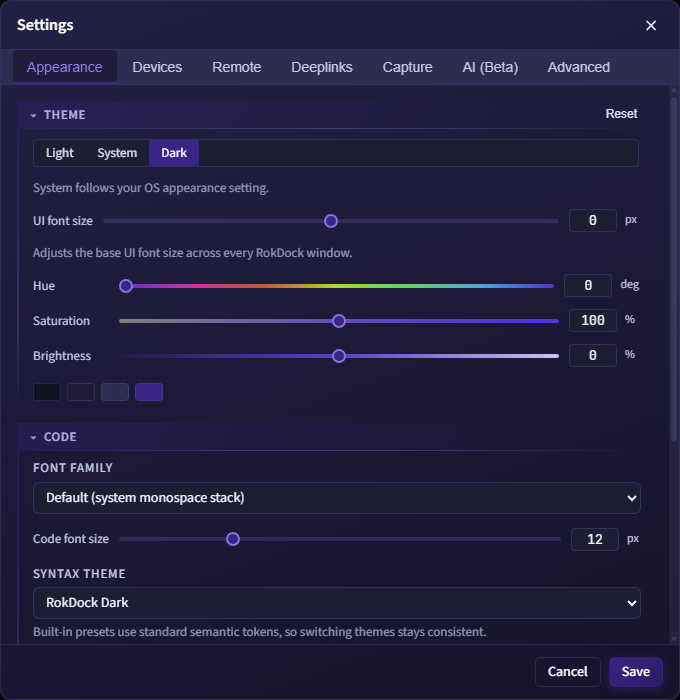

# Terminal

RokDock uses a custom built-in terminal emulator for Roku debug sessions.

## Terminal Tabs

- Each connection opens a tab.
- Tab status indicators include: connecting, connected, disconnected, and error.
- The active tab in the focused pane determines the remote target device.
- Tabs can be closed individually with the X button or middle-click.
- Tabs can be dragged to reorder within a pane or moved to the other pane in split view.
- A terminal settings button (gear icon) is available in the top-right corner of the terminal area.

## Tab Indicators

Each tab displays several visual indicators:

- **Status dot**: shows connection state
  - Amber/yellow: connecting
  - Green: connected
  - Gray: disconnected
  - Red: error
- **Port color stripe**: a colored bar matching the port color configured in Settings
- **Buffer meter**: a thin track showing buffer usage
  - Green: below 65% capacity
  - Yellow: 65-95% capacity
  - Red: above 95% capacity
  - Maximum buffer: 5,000 lines
- **Activity indicator**: an amber dot that pulses on inactive tabs when new output arrives
- **Tab tooltip**: hover to see device name, port label, IP:port, and buffer usage (e.g., "Buffer: 2,400 / 5,000 lines (48%)")
- **Label overflow**: long tab labels animate (slide left) on hover so the full label is readable

## Tab Context Menu

Right-click a tab chip to open the tab context menu:

- **Close**: close this tab
- **Close Others**: close every other tab in this pane
- **Close All**: close all tabs in this pane
- **Split Right** (when not already split, requires at least two tabs): open a second pane with this tab
- **Move to Other Pane** (when already split): send this tab to the other pane

## Output Rendering

The terminal renders semantic tokenized output instead of raw plain text.

Highlights include:

- BrightScript/VB-style syntax token coloring
- Prompt/debugger prompt emphasis
- URL detection with hover tooltip and safe open confirmation
- JSON detection and click-to-open JSON Viewer
- Optional theme background integration

*A connected terminal tab at a BrightScript debugger break. Output is tokenized and colored, and detected URLs are underlined as links.*

## Search

Open search with:

- `Ctrl/Cmd + F`
- Terminal context menu > **Find...**

Search supports:

- Match Case (`Aa`)
- Match Whole Word (`W`)
- Regex (`.*`)
- Previous/Next navigation
- Enter for next match, Shift+Enter for previous
- Active-match and line-level highlighting
- Focus return to terminal when closing search

## Command Input

Bottom input bar supports:

- Enter to send command
- Echo command into terminal output
- Up/Down arrows for command history navigation
- History flyout button showing the 20 most recent commands

History behavior:

- Persisted across app sessions
- Deduplicated (latest instance wins)
- Max capacity: 1,000 commands

## Session Controls

Terminal session actions:

- Connect / reconnect / disconnect
- Interrupt (Ctrl/Cmd+C in input when no text is selected)
- Clear output (`Alt+C`)

## Context Menu

Right-click inside terminal output for:

- Copy
- Paste
- Select All
- Find...
- Clear Terminal
- Auto-scroll toggle
- Word Wrap toggle
- Save Output...
- Start Streaming Output... / Stop Streaming Output
- Reconnect
- Disconnect

## Scrolling and Buffer

- Terminal scrollbar remains visible when history exists.
- Internal visible line buffer is capped at 5,000 lines.

## Word Wrap and Auto-scroll

Both are configurable per tab via the context menu:

- **Word Wrap** controls line wrapping behavior.
- **Auto-scroll** controls stick-to-bottom behavior during incoming output.

Both settings are per-tab and persist for the lifetime of that tab.

## Split Panes

RokDock supports two side-by-side terminal panes.

- Click **Split Right** in the tab context menu (or the split icon in the toolbar when two or more tabs are open) to create a second pane.
- Drag a tab to the right 20% edge of the terminal area to split-drop it into a new pane.
- Drag the divider between panes to resize them.
- Drag a tab from one pane's tab bar to the other pane's tab bar to move it across panes.

## JSON and URL Interaction

- Detected JSON segments show hover metadata and open the [JSON Viewer](json-viewer.md) on click.
- Detected URLs are underlined on hover. The entire URL (including query string) underlines as a single link regardless of syntax coloring differences within the URL.

### URL Explorer Dialog

Clicking a URL opens an **Open External Link** dialog with:

- **URL display** in a monospace box with a **Copy** button
- **Query params** collapsible section (if the URL has a query string):
  - Sortable table of key-value pairs. Click **Key** or **Value** headers to sort.
  - **Table** button: copies all params as an aligned text table
  - **TSV** button: copies all params as tab-separated values
- **Open Link** button to open the URL in your system browser

This is useful for inspecting long ad URLs, analytics beacons, and API calls that appear in terminal output.

## Save vs Stream Output

- **Save Output...** writes a one-time snapshot of current visible terminal text to a file.
- **Start Streaming Output...** opens a file picker, then continuously appends new terminal output to the selected file until **Stop Streaming Output** is chosen.

## Configuring Terminal Appearance

Open **Settings > Appearance** to configure font and syntax options. The gear icon in the terminal tab bar opens this tab scrolled to its Terminal section.

_Settings > Appearance: the Code section sets font family, font size, syntax theme, and the use-theme-background toggle with a live preview._

Options include:

- **Font family** and **font size** (Code section) applied to both the terminal output and command input, and shared with the JSON Viewer
- **Syntax theme** (Code section): choose from preset color schemes or "No colorization" for plain unstyled text
- **Use theme background** (Code section): when enabled, the terminal background color comes from the active syntax theme rather than the app background
- **Tab label format** (Terminal section): choose between device name with port number (e.g., "MyRoku (8085)") or IP address with port (e.g., "192.168.1.10:8085")

## Tips

- Use regex search for stack traces and specific debugger prompt patterns.
- Use streaming output during long debug sessions to preserve output that scrolls off the 5,000-line buffer.
- Move the pointer over terminal output to enable multi-line JSON detection.
