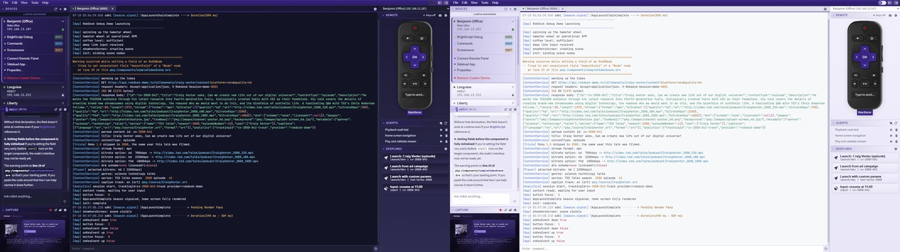

# Themes

RokDock has two independent theme systems: an app-wide light/dark mode and a
per-terminal syntax theme. You can combine them freely, for example using dark
app chrome with a light syntax theme.

*Dark mode (left) and light mode (right). Toggling the app theme also swaps the terminal syntax theme to its light or dark companion.*

## App Theme vs Syntax Theme

- **App theme** (light/dark/system): controls the workspace chrome,
  backgrounds, borders, and panels. Toggle via the switch in the top menu bar,
  or pick Light / System / Dark in the Theme section of **Settings >
  Appearance**. System follows the operating-system theme and flips live when
  it changes.
- **Syntax theme**: controls terminal token colors such as keywords, strings,
  numbers, and the BrightScript debugger prompt. Configure in the Code section
  of **Settings > Appearance**.

One notable design choice: the toolbar at the top of the window uses the same
purple gradient in both light and dark mode. Only the workspace and terminal
areas change when you switch themes.

## Where to Configure

Open **Settings > Appearance**. The font and syntax controls live in the
collapsible **Code** section, which the terminal and the JSON Viewer share. The
app light/dark mode lives in the **Theme** section of the same tab, and the
terminal tab-label format lives in the **Terminal** section.

## Font

The **Code** section contains:

- **Font Family**: a preset picker with 16 named monospace fonts plus a
  "Custom..." entry for typing any font string. Choosing "Custom..." switches
  to a free-text input, and clicking the X returns to preset mode. Selecting
  "Default (system monospace stack)" clears the override and falls back to
  the built-in monospace stack.
- **Font Size**: a slider from 8 px to 24 px.

The font and syntax settings apply to both the terminal output and the JSON
Viewer.

Named font presets: Cascadia Code, Cascadia Mono, Consolas, Courier New,
DejaVu Sans Mono, Fira Code, Fira Mono, Hack, IBM Plex Mono, Inconsolata,
JetBrains Mono, Lucida Console, Menlo, Monaco, Source Code Pro, Ubuntu Mono.

## Syntax Theme

The **Code** section also contains:

- **Syntax Theme** preset picker (see list below).
- **Use theme background color** toggle: when on, the terminal viewport
  background and JSON Viewer background follow the selected syntax theme's
  own background color. Off by default so the terminal background stays
  aligned with the RokDock UI.
- **Text Color** (shown only when **No colorization** is selected): a color
  picker and hex input for the fallback monochrome text color. Persists
  independently from the selected preset.
- A live preview panel that renders sample BrightScript output in the current
  font and syntax theme so you can judge readability before saving.

## Built-in Syntax Theme Presets

### RokDock

- RokDock Dark
- RokDock Light

### Popular

- Atom One Dark
- Atom One Light
- One Light
- One Dark Pro
- Dracula
- Nord
- Solarized Dark
- Solarized Light
- Monokai
- Tokyo Night
- Tokyo Night Day
- GitHub Dark
- GitHub Light
- Gruvbox Dark
- Gruvbox Light
- Catppuccin Mocha
- Catppuccin Latte

### Special

- No colorization

## No Colorization Mode

When **No colorization** is selected, token-based syntax colors are disabled
and the terminal renders all text in the **Text Color** fallback. The fallback
value persists and can be tuned for readability on any background.

## Background Behavior

By default the terminal viewport uses the standard RokDock terminal
background, keeping it visually consistent with the rest of the UI regardless
of which syntax theme is active.

When **Use theme background color** is enabled:

- The terminal viewport background switches to the syntax theme's own
  background color.
- The JSON Viewer background follows the same themed color.

This is useful when you want the terminal to feel self-contained, for example
when using Dracula or Solarized Dark as a full dark terminal inside a
light-mode workspace.

## JSON Viewer Theme Integration

When you open JSON content from a terminal overlay:

- The active syntax palette passes into the JSON Viewer so token colors remain
  consistent.
- Light/dark mode remains consistent with the app theme.
- When **No colorization** is active the JSON Viewer uses the fallback text
  color.
- Screenshot Preview and 9-Patch Editor follow the current app theme.

## Recommendations

- Use a dark preset for long debug sessions to reduce eye strain.
- Leave **Use theme background color** off if you want stable contrast across
  all themes regardless of which preset is active.
- Use No colorization with a custom text color for minimal, distraction-free
  output.
